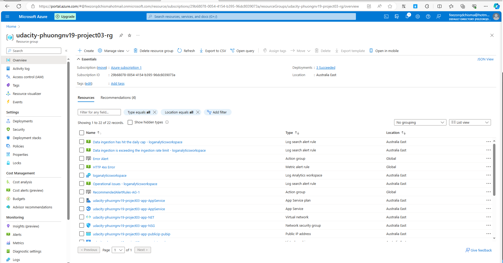
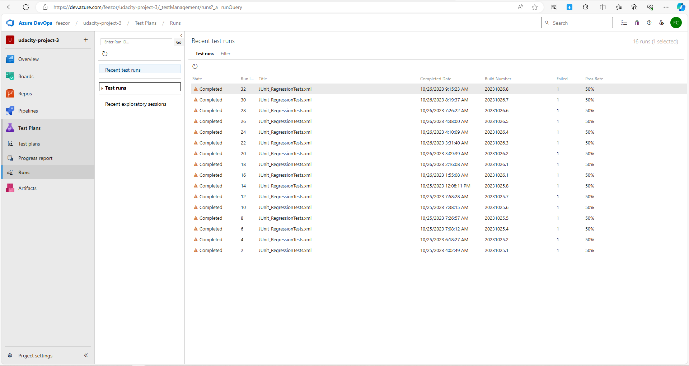

# Overview

This document presents the final project "Ensuring Quality Releases" for Udacity.

# Project Structure

- **azure-pipelines.yaml**: This file contains Azure Pipelines YAML configurations.
- **automatedtesting**: This directory contains suites of different tests:
  - **jmeter**: Load test files including JMeterPlan.jmx, CSV inputs, and TestReports (endurance-report, stress-report).
  - **postman**: Functional test files in Postman collections and environments.
  - **selenium**: UI tests implemented in uitests.py.
- **screenshots**: This folder contains various screenshot requests.
- **terraform**: Terraform scripts used for Infrastructure as Code (IaC).
---

## Environment Creation & Deployment

### Terraform Infrastructure Deployment

We use Terraform to apply Infrastructure as Code (IaC). Below are screenshots of the log output of Terraform when executed by the CI/CD pipeline:

- 
- 
- 

### Automated Testing Tasks

Here, we provide a screenshot of the successful execution of the pipeline build results page (`/_build/results?buildId={id}&view=results`):

- 

## Automated Testing

### Load Test Suite

The following are screenshots of the log output of JMeter when executed by the CI/CD pipeline:

- 
- 

### Functional Test Suites

Here's a screenshot of the execution of the test suite by the CI/CD pipeline:

- 

### API-Integration Tests

- Screenshot of the output of the Publish Test Results step:
  - 

- Screenshot of the Run Summary page, which contains four graphs:
  - 

- Screenshot of the Test Results page, which contains the test case titles from each test:
  - 

## Monitoring & Observability

### Configure Azure Monitor

Here are screenshots of the graphs of the resource when the alert was triggered:

- 

And here's a screenshot of the alert rule:

- 

Additionally, we have screenshots related to AppService alerts:

- 

Finally, there are screenshots of the email received when the alert is triggered:

- 

### Azure Log Analytics

Screenshots of log analytics queries and result sets, which show specific output of the Azure resource:

- 
